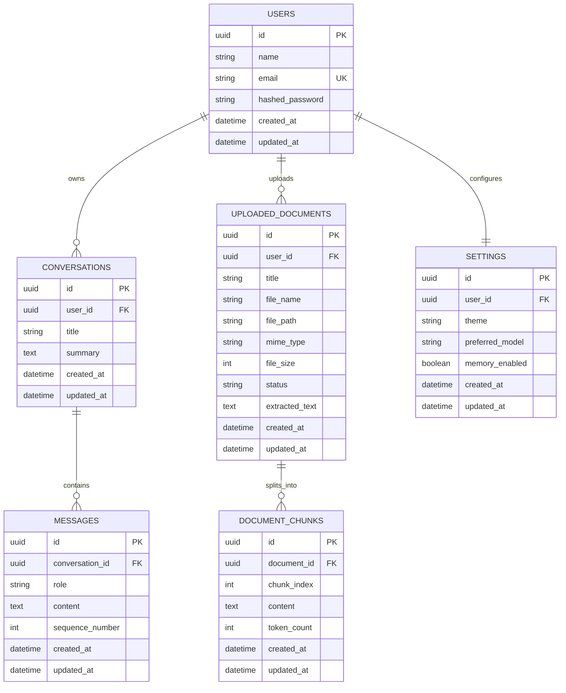

# Phase 3 Database Architecture

This phase introduces the core PostgreSQL schema for the Personal AI Knowledge Assistant using SQLAlchemy ORM, Alembic migrations, UUID primary keys, cascading deletes, and a reusable repository layer.

## ER Diagram Explanation



## Relationship Design

- `users -> conversations` is one-to-many so each user can have many chat threads.
- `conversations -> messages` is one-to-many so each thread preserves an ordered message history.
- `users -> uploaded_documents` is one-to-many so a user can manage many source files.
- `uploaded_documents -> document_chunks` is one-to-many so retrieval pipelines can split files into embeddings-ready chunks.
- `users -> settings` is one-to-one so each user has a single configuration profile.

## Constraint and Index Strategy

- Every table uses a UUID primary key to support distributed creation and safer external references.
- Every relationship uses foreign keys with `ON DELETE CASCADE` so dependent records are removed automatically.
- Every table includes `created_at` and `updated_at` timestamps.
- Important lookup paths are indexed:
  - `users.email`
  - `conversations.user_id`, `conversations.user_id + updated_at`
  - `messages.conversation_id`, `messages.conversation_id + created_at`
  - `uploaded_documents.user_id`, `uploaded_documents.user_id + status`, `uploaded_documents.user_id + updated_at`
  - `document_chunks.document_id`, `document_chunks.document_id + chunk_index`
  - `settings.user_id`
- Ordering integrity is protected with unique constraints on:
  - `messages (conversation_id, sequence_number)`
  - `document_chunks (document_id, chunk_index)`

## Files Added In Phase 3

- SQLAlchemy models in `backend/app/models/`
- Pydantic schemas in `backend/app/schemas/`
- Repositories in `backend/app/repositories/`
- DB session manager in `backend/app/db/session.py`
- Alembic config in `backend/alembic.ini` and `backend/alembic/`

## Migration Workflow

From the `backend` folder:

```bash
alembic upgrade head
```

To generate future revisions after model changes:

```bash
alembic revision --autogenerate -m "describe change"
alembic upgrade head
```
